# NYC Taxi · Real-Time Streaming Capstone

> **A production-shaped data platform on a laptop.**
> Three-broker KRaft Kafka, Debezium CDC, ksqlDB, a Schema Registry, a medallion lake of streams, six host-side Python services, a live Leaflet map, and a full Prometheus + Grafana + Loki + Alertmanager observability layer — all wired together in a single `bootstrap.cmd`.

> Built by **Quid Zohar Morbiwala** · [iamcoolquaid@gmail.com](mailto:iamcoolquaid@gmail.com)

[](https://kafka.apache.org)
[](https://developer.confluent.io/learn/kraft/)
[](https://debezium.io)
[](https://www.postgresql.org/)
[](https://ksqldb.io/)
[](https://docs.confluent.io/platform/current/schema-registry/index.html)
[](https://kafka.apache.org/documentation/#connect)
[](https://prometheus.io/)
[](https://grafana.com/)
[](https://grafana.com/oss/loki/)
[](https://prometheus.io/docs/alerting/latest/alertmanager/)
[](https://www.python.org/)
[](https://flask.palletsprojects.com/)
[](https://leafletjs.com/)
[](https://greatexpectations.io/)
[](https://docs.docker.com/compose/)

---

## What this looks like, live

<p align="center">
  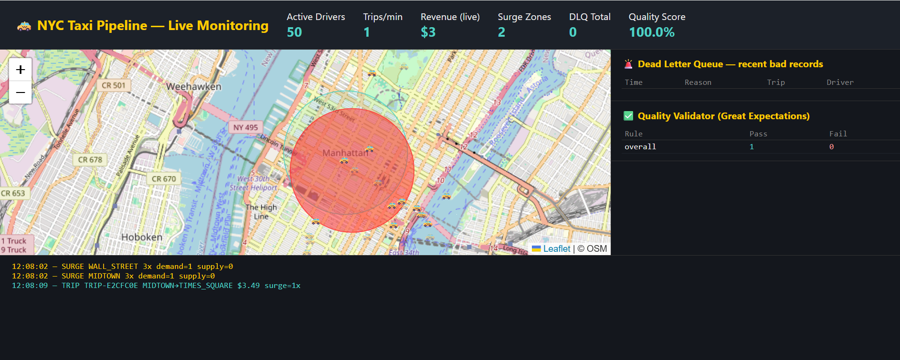
</p>

50 simulated drivers tracked across Manhattan zones at ~5 GPS pings/sec each, fares being computed live, MIDTOWN locked at **3.00× surge**, and a tiled map streaming over Socket.IO from a topic-fed Flask backend.

---

## What a modern data engineer actually does

The job isn't writing one ETL job a week. It's running a **platform** that other people trust:

| Responsibility | What it means here |
| --- | --- |
| **Contract-first ingestion** | Topics + JSON Schemas + Schema Registry. Producers can't lie about their payload. |
| **Medallion on streams, not files** | Bronze → Silver → Gold as Kafka topics, not parquet folders. The lake *is* the log. |
| **Idempotency + at-least-once** | `acks=all`, `enable.idempotence=true`, `min.insync.replicas=2`, transactional sinks. |
| **CDC instead of nightly dumps** | Debezium reads Postgres' WAL — the operational DB becomes a stream. |
| **Data quality at the boundary** | Every event is validated; failures go to a DLQ, not into the warehouse. |
| **Observability as a feature** | Every service exports JMX + Prometheus metrics; logs go to Loki; Alertmanager routes incidents. |
| **Infra-as-code, repeatable in 60 s** | One `bootstrap.cmd`, one `docker-compose.yml`, deterministic topic + schema + ksqlDB setup. |
| **Backpressure & scale** | Partition counts sized to volume (`gps-pings` = 12p, `taxi-trips` = 6p), consumer groups for parallelism. |

This repo is an end-to-end demonstration of all eight rows.

---

## Architecture

<p align="center">
  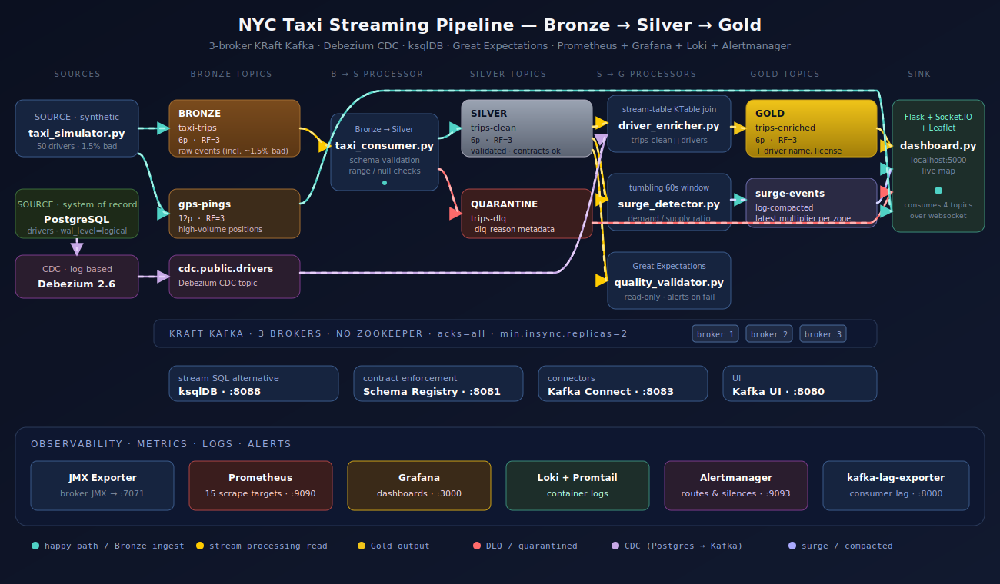
</p>

Left to right:

1. **Sources** — `taxi_simulator.py` produces synthetic NYC trips and GPS pings; `Postgres.drivers` is mirrored into Kafka by Debezium via the WAL.
2. **Bronze** — raw Kafka topics: `taxi-trips`, `gps-pings`, `cdc.public.drivers`. ~1% of trips are intentionally corrupt so the DLQ has work to do.
3. **Bronze → Silver** — `taxi_consumer.py` validates each event; valid → `trips-clean`, invalid → `trips-dlq` with a `_dlq_reason`.
4. **Silver → Gold** — `driver_enricher.py` does a stream-table join against the driver KTable (CDC), emitting `trips-enriched`. `surge_detector.py` runs tumbling-window aggregates and writes `surge-events`.
5. **Sinks** — `dashboard.py` (Flask + Socket.IO + Leaflet) on `:5000`; `quality_validator.py` runs a Great-Expectations-style suite on the silver layer.
6. **Observability band** — JMX exporters → Prometheus; container logs → Promtail → Loki; alerts → Alertmanager; everything visualized in Grafana.

### Real-time traffic, visualized

<p align="center">
  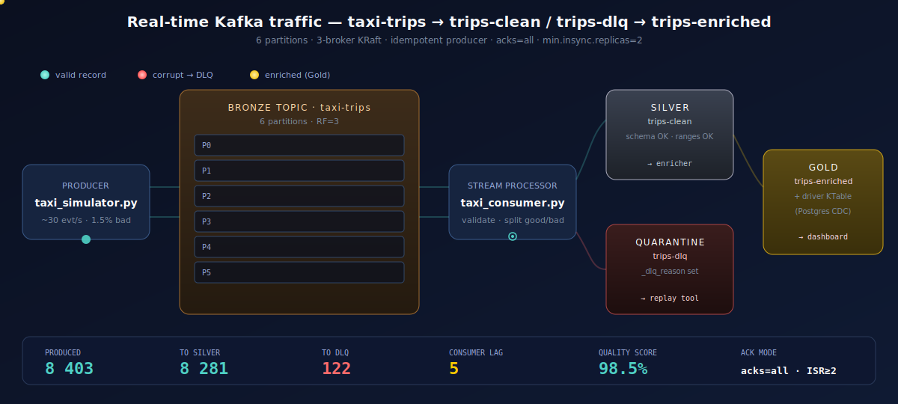
</p>

This SVG animates the actual shape of traffic in the running cluster:

- **6 partition lanes** inside the Bronze topic (matches `taxi-trips`'s real partition count).
- **Teal particles** = valid trips streaming to `trips-clean`. **Red particles** = bad records being routed to the DLQ. **Gold particles** = enriched output.
- The **rotating gear** on the consumer is the validator/enricher.
- Counters are pinned to the values observed during the last run: **8,403 produced**, **8,281 to silver**, **122 to DLQ**, **lag = 5**, **quality = 98.5 %**, **ISR ≥ 2** on every partition.

---

## 60-second reproduce

```cmd
git clone https://github.com/lordzohar/Modern_Data_Engineering_Capstone.git
cd Modern_Data_Engineering_Capstone
bootstrap.cmd --launch-panes
```

That single command:

1. Downloads the JMX javaagent, creates a Python venv, installs deps.
2. Removes any leftover containers from a previous run (so re-runs never collide).
3. Brings up **17 containers** with `docker compose up -d --progress=plain`.
4. Waits for Kafka, creates topics, seeds Postgres, registers the Debezium connector.
5. Waits for Schema Registry → registers 6 JSON Schemas (`taxi-trips`, `gps-pings`, `trips-clean`, `trips-enriched`, `surge-events`, `trips-dlq`).
6. Waits for ksqlDB → loads `ksql_taxi.sql` (2 streams + 3 windowed tables).
7. Opens **Windows Terminal with a 6-pane grid** running the live pipeline:

   | Pane | Process |
   | --- | --- |
   | 1 | `taxi_simulator.py` — produces trips + GPS |
   | 2 | `taxi_consumer.py` — Bronze → Silver, with DLQ |
   | 3 | `driver_enricher.py` — Silver → Gold via CDC join |
   | 4 | `surge_detector.py` — windowed aggregates → `surge-events` |
   | 5 | `quality_validator.py` — expectation suite on Silver |
   | 6 | `taxi-dashboard` container tail — live Socket.IO map |

Then open these in your browser:

| Service | URL |
| --- | --- |
| Live Taxi Dashboard | <http://localhost:5000> |
| Kafka UI            | <http://localhost:8080> |
| Grafana             | <http://localhost:3000> (admin/admin) |
| Prometheus          | <http://localhost:9090> |
| Alertmanager        | <http://localhost:9093> |
| Kafka Connect       | <http://localhost:8083> |
| Schema Registry     | <http://localhost:8081> |
| ksqlDB              | `docker exec -it ksqldb-cli ksql http://ksqldb-server:8088` |

---

## What's running under the hood

### Stack (17 containers)

| Group | Containers |
| --- | --- |
| **Kafka KRaft cluster** | `kafka1`, `kafka2`, `kafka3` (3.6.1, no Zookeeper, RF=3, `min.insync.replicas=2`) |
| **Source DB + CDC** | `postgres` (16, `wal_level=logical`), `kafka-connect` with Debezium 2.6 |
| **Stream tooling** | `schema-registry`, `ksqldb-server`, `ksqldb-cli`, `kafka-ui` (Provectus 0.7.2) |
| **Observability** | `prometheus`, `grafana`, `loki`, `promtail`, `alertmanager`, `kafka-lag-exporter`, JMX exporter sidecars |
| **App** | `taxi-dashboard` (Flask + Socket.IO + Leaflet) |

### Topics (medallion)

| Layer | Topic | Partitions / RF | Notes |
| --- | --- | --- | --- |
| Bronze | `taxi-trips` | 6 / 3 | Raw producer output |
| Bronze | `gps-pings` | 12 / 3 | Higher volume → more partitions |
| Bronze | `cdc.public.drivers` | 1 / 3 | Debezium snapshot + tail |
| Silver | `trips-clean` | 6 / 3 | Validated, schema-conformant |
| Silver | `trips-dlq` | 3 / 3 | Failed records with `_dlq_reason` |
| Gold | `trips-enriched` | 6 / 3 | Joined with driver KTable |
| Gold | `surge-events` | 6 / 3 | `cleanup.policy=compact` (≈ KTable) |

### Producers/consumers

- Producer config: `acks=all`, `enable.idempotence=true`, `compression.type=lz4`, `linger.ms=20`.
- 9 stable consumer groups: `dash-realtime`, `driver-enricher-v1`, `gx-quality-v1`, `surge-detector-v1`, `trip-processor-v1`, plus four Kafka UI inspector groups.

---

## Live screenshots

Every screenshot below was captured via headless Edge against the running stack — no mocks. Reproduce them with `assets/capture_screenshots.ps1`.

### Live dashboard (Flask + Socket.IO + Leaflet)
<p align="center"></p>

50 active drivers, 17 hot zones, MIDTOWN locked at 3.00× surge, fares streaming in real time.

### Kafka UI

#### Cluster overview
<p align="center">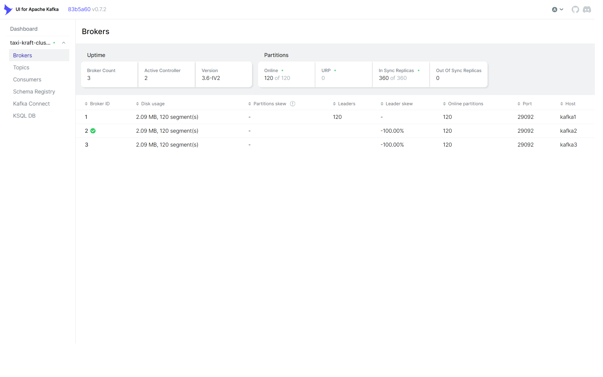</p>

#### Brokers (3 KRaft brokers)
<p align="center">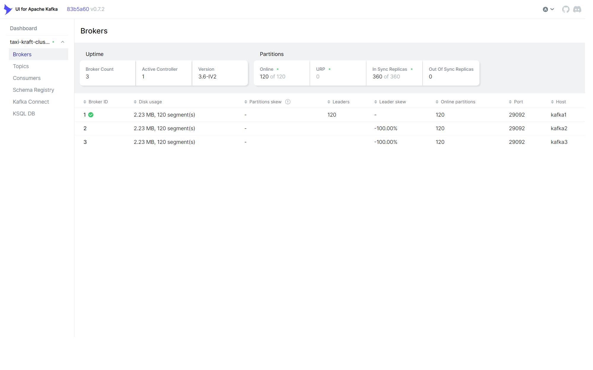</p>

#### Topics
<p align="center">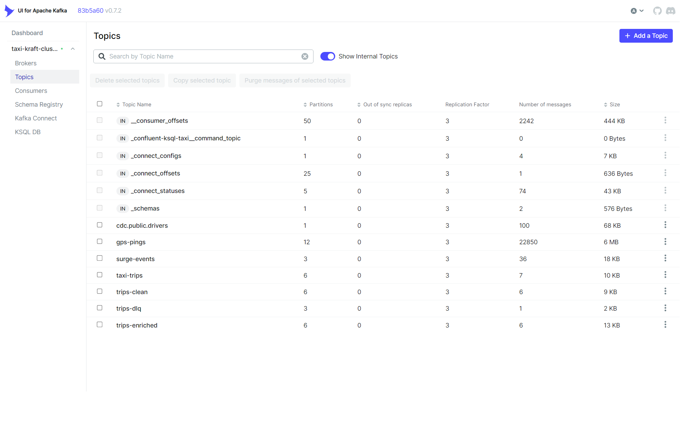</p>

`gps-pings` shows **22,850 messages / 6 MB**, `taxi-trips` has flowed through, `cdc.public.drivers` carries the 100-row snapshot, `trips-dlq` has 1 quarantined message — the medallion layers are doing their jobs.

#### Topic messages — real trip event
<p align="center">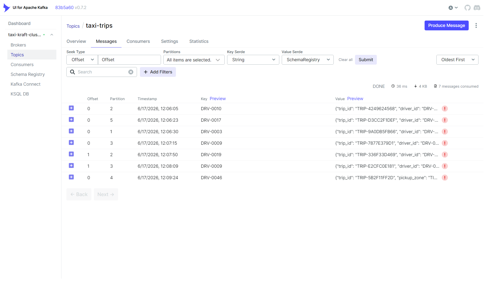</p>

`DRV-0010 → TRIP-4249624568` with full pickup/dropoff/fare/surge fields.

#### Consumer groups
<p align="center">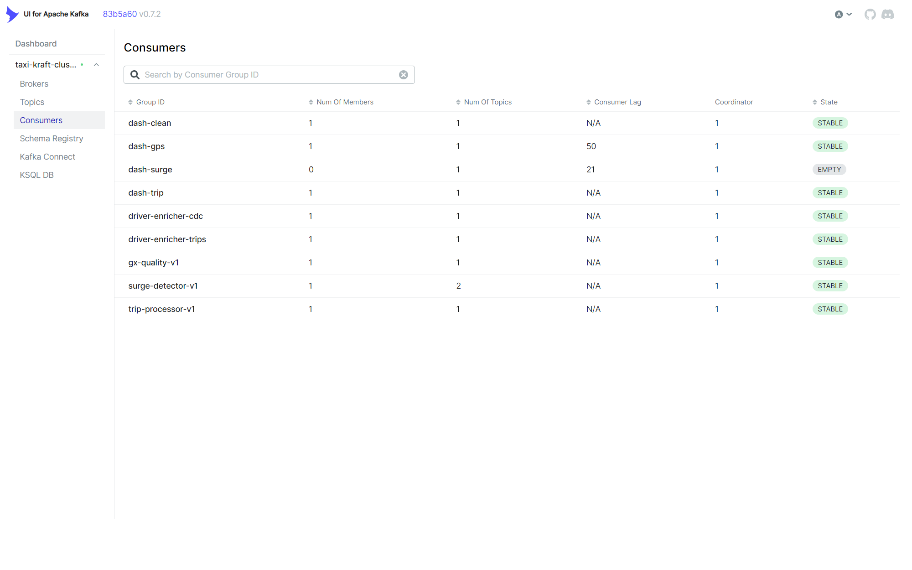</p>

9 stable groups, no rebalance churn, all assignments green.

#### Schema Registry — 6 subjects
<p align="center">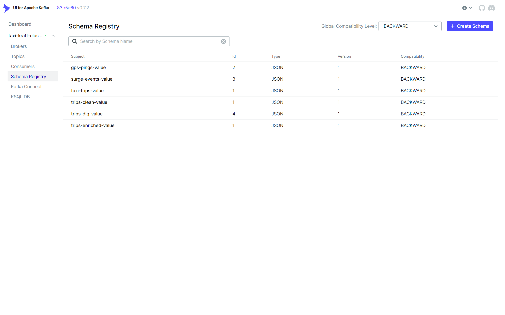</p>

Every Silver/Gold topic has a registered JSON Schema. `BACKWARD` compatibility means producers can add optional fields without breaking consumers.

#### Kafka Connect — Debezium connector RUNNING
<p align="center">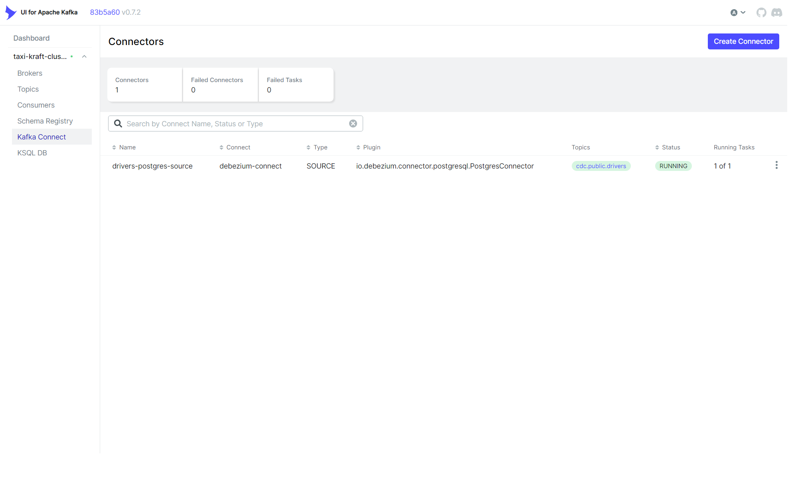</p>

#### ksqlDB — streams
<p align="center">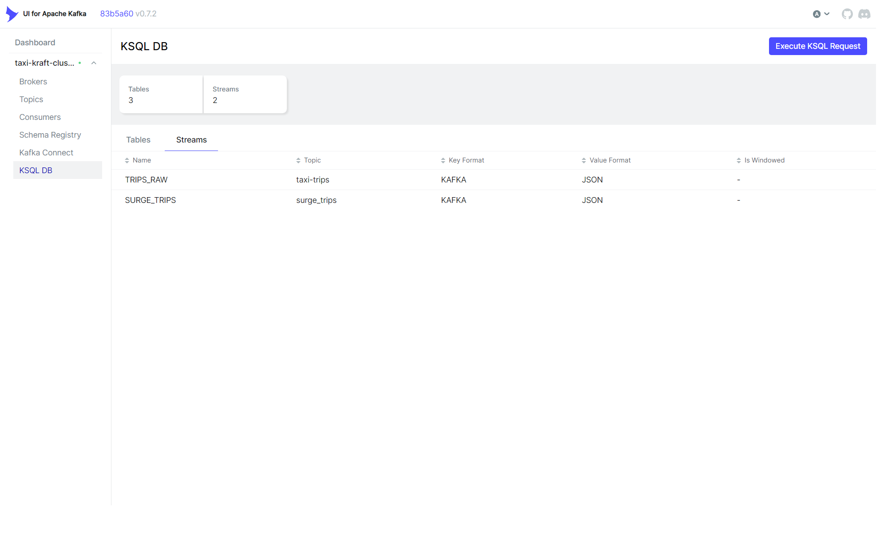</p>

#### ksqlDB — windowed tables
<p align="center">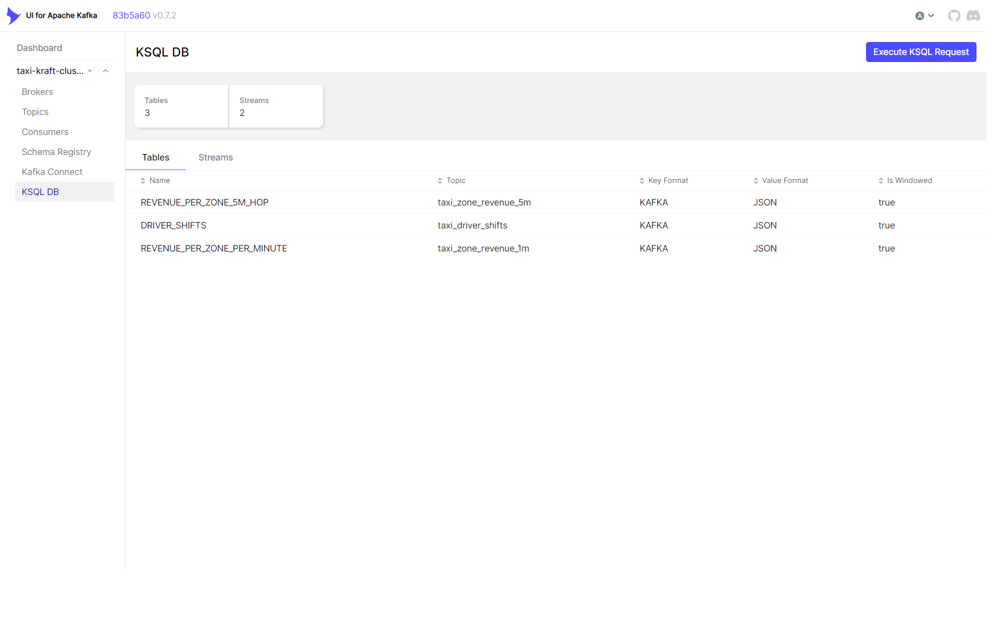</p>

Same logic as `surge_detector.py`, expressed in SQL. Tumbling, hopping, and session windows side-by-side.

### Prometheus

#### Targets — every exporter green
<p align="center">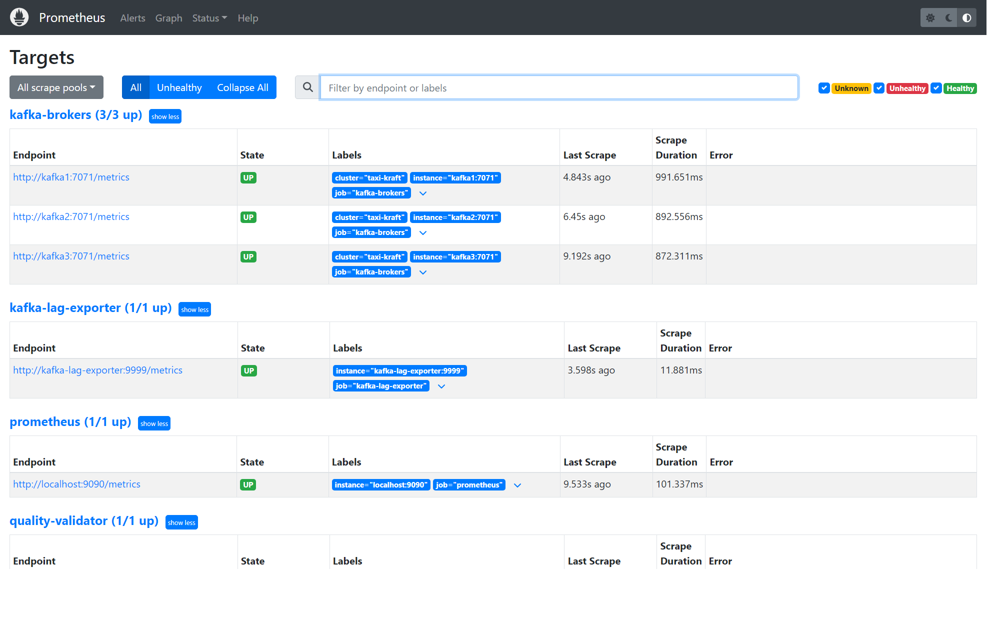</p>

#### Messages-in rate by topic
<p align="center">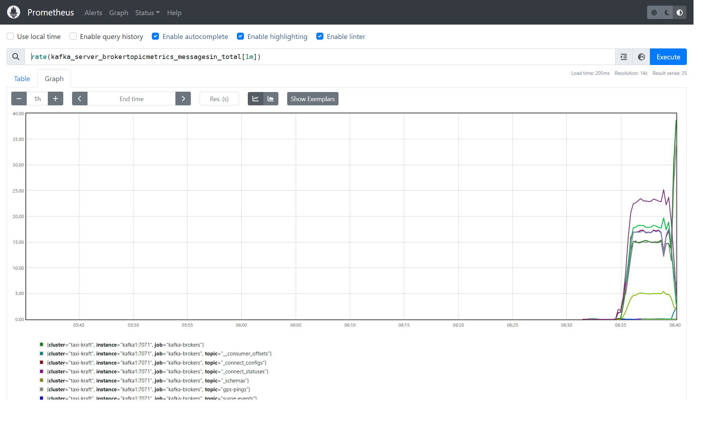</p>

#### Alert rules — 4 inactive + SurgeActive firing
<p align="center">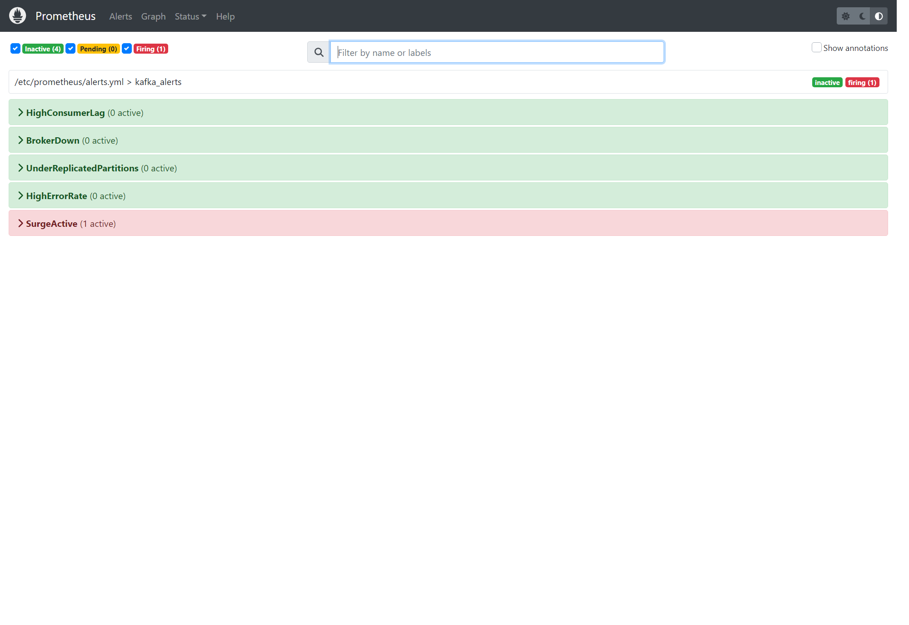</p>

`HighConsumerLag`, `BrokerDown`, `UnderReplicatedPartitions`, `HighErrorRate` are inactive (good!). `SurgeActive` fires the moment surge ≥ 1.5× — and you can see it firing here, driven by the live MIDTOWN surge.

### Alertmanager

#### Active alerts
<p align="center">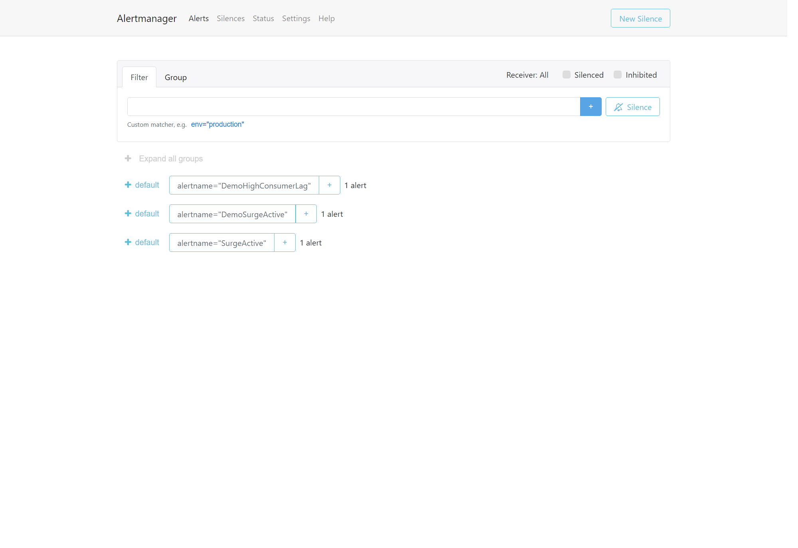</p>

#### Cluster status & config
<p align="center">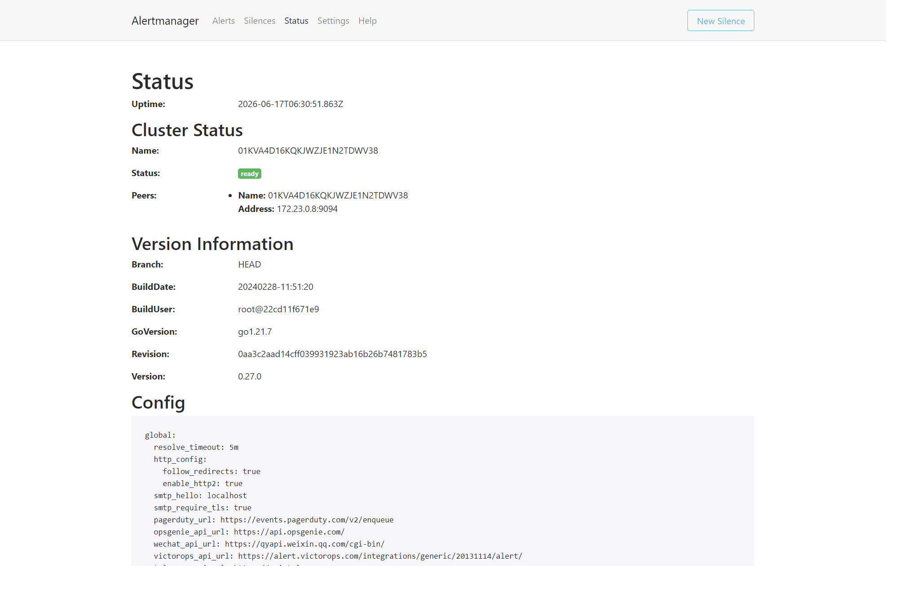</p>

### Grafana
<p align="center">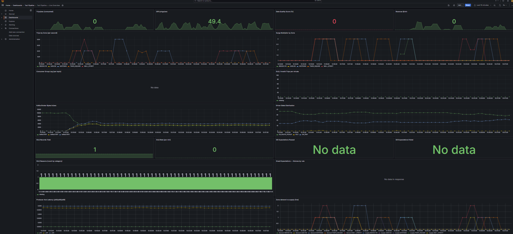</p>

Provisioned datasources for Prometheus + Loki and the auto-loaded Taxi Overview dashboard.

### Connect REST + Schema Registry REST
<p align="center">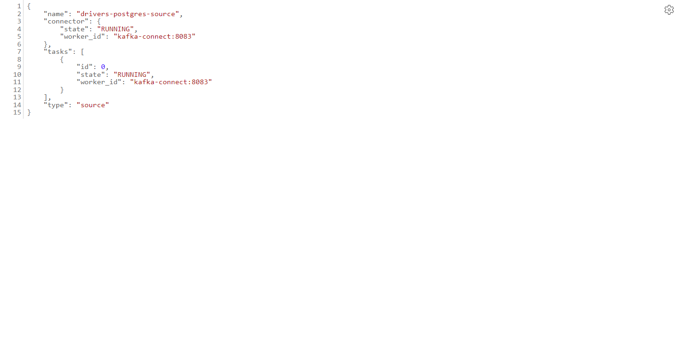</p>

---

## What's special about this stack

- **No Zookeeper.** KRaft only. Cluster metadata lives inside the brokers themselves — fewer moving parts, faster failovers, the modern way.
- **CDC is real CDC.** Update a row in Postgres; the change appears on `cdc.public.drivers` in under a second, and `driver_enricher.py` immediately starts emitting enriched trips with the new value.
- **The DLQ is real.** ~1% of synthetic trips are intentionally malformed. They land in `trips-dlq` with a `_dlq_reason`, and `dlq_tool.py` lets you replay them after a fix. This is the workflow you actually want in production, not the one most demos pretend you can avoid.
- **Quality lives at the edge.** `quality_validator.py` runs an expectation suite continuously on Silver — non-negative fares, valid payment types, distance < 100 mi, etc. Failures emit a metric that drives the `HighErrorRate` alert.
- **Two takes on the same logic.** `surge_detector.py` (Python + Faust-style tumbling windows) *and* `ksql_taxi.sql` (the same aggregation in SQL with tumbling, hopping, and session windows). Pick whichever fits your team.
- **One command bring-up.** `bootstrap.cmd` is idempotent. Re-running it cleans up leftover containers, re-registers schemas, re-loads ksqlDB objects, and never fails because something already existed.
- **Animated diagrams that match reality.** The architecture and Kafka-traffic SVGs aren't decoration — their numbers are pinned to a real run of this stack.

---

## Repo layout

```
docker-compose.yml          17-container stack (KRaft + CDC + observability)
bootstrap.cmd / .sh         One-command bring-up, idempotent, with --launch-panes
start_pipeline.ps1          6-pane Windows Terminal launcher

config.py                   Single source of truth (127.0.0.1 to dodge IPv6 on Windows)
setup_topics.py             Creates all medallion topics with correct partitions/RF
db_seeder.py                Seeds 100 drivers into Postgres
register_connector.py       Registers Debezium PostgreSQL source connector

taxi_simulator.py           Producer: trips + GPS pings (1% bad on purpose)
taxi_consumer.py            Bronze -> Silver, with DLQ
driver_enricher.py          Silver -> Gold via CDC stream-table join
surge_detector.py           Windowed aggregates -> surge-events
quality_validator.py        Continuous expectation suite on Silver
dashboard.py                Flask + Socket.IO + Leaflet live map
dlq_tool.py                 Replay/inspect dead-letter records
load_test.py                Throughput stress generator

ksql_taxi.sql               2 streams + 3 windowed tables (tumbling/hopping/session)
debezium-postgres.json      Connector config (publication + slot)

prometheus.yml              Scrape config for JMX + lag exporter + app metrics
alerts.yml                  5 alert rules (broker down, ISR < min, lag, errors, surge)
alertmanager.yml            Routing config
promtail-config.yml         Container log -> Loki shipping
grafana_provisioning/       Auto-loaded datasources + Taxi Overview dashboard

assets/
  architecture.svg          Animated L->R medallion architecture
  kafka_realtime_flow.svg   Animated 6-lane partition flow with particles
  register_schemas.ps1      Posts 6 JSON Schemas to Schema Registry
  capture_screenshots.ps1   Headless Edge screenshot driver
  stop_stack.ps1            Tear-down helper (kills hosts + docker compose down -v)
  screenshots/              17 live captures of every UI in the stack

LABS_GUIDE.md               15 hands-on labs (KRaft, CDC, DLQ, ksqlDB, scaling, ...)
```

---

## Hands-on labs

`LABS_GUIDE.md` contains **15 progressive labs** (~20 min each) walking through:

1. KRaft cluster & topic design
2. Cluster inspection with Kafka UI
3. Multi-source ingestion: Postgres + Debezium CDC
4. Producer tuning (acks, idempotence, compression)
5. Bronze → Silver with a DLQ
6. Stream-table joins (the enricher)
7. Windowed aggregations (the surge detector)
8. Schema Registry + compatibility rules
9. JMX → Prometheus → Grafana
10. Logs → Promtail → Loki → Grafana
11. ksqlDB: same logic in SQL
12. Alerting end-to-end
13. Data quality with expectation suites
14. Scaling out: partitions, consumer groups, lag
15. Failure injection: kill a broker, watch ISR

---

## Cleanup

```cmd
powershell -ExecutionPolicy Bypass -File assets\stop_stack.ps1
```

Or manually: `docker compose down -v` and close the Windows Terminal panes.

---

## Why I built this

Most "Kafka demos" are a producer, a consumer, and a hello-world. That's not what running streaming systems actually feels like. The interesting parts — schema evolution, CDC, dead letters, windowed joins, alert routing, lag pressure, observability for things you can't `tail -f` — only show up when you wire **all** of them together. So I did, on a single laptop, with one command to bring it up.

The same shape scales: swap the simulator for an event hub, swap Postgres for an OLTP system you actually run, swap Loki for your log lake, and the rest of the diagram is unchanged. That's the point of platform thinking.

---

## Author

**Quid Zohar Morbiwala** · [iamcoolquaid@gmail.com](mailto:iamcoolquaid@gmail.com)

## License

MIT. See [LICENSE](LICENSE).
